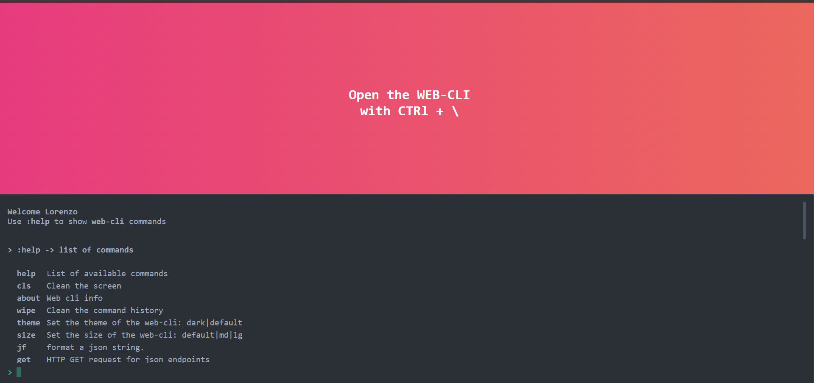

# web-cli




My first attemp with __Web Components__ for creating a web development terminal like the console in FPS games (Quake, Unreal, etc....). 

Check the online demo [here](https://blissful-williams-cd0fdc.netlify.app/) by opening the __web-cli__ with   `ctrl + \`.

## Usage
First install dependencies:

```sh
npm install
```

To run a development server in hot module reloading mode:

```sh
npm start
```

To create a production build:

```sh
npm run build-prod
```

# Commands
- [x] :help -> Show a list of commands
- [x] :theme __big/default__ -> change themes 
- [x] :size __big/default__ -> change size of the console window
- [x] :clean -> Clean the console window
- [x] :wipe -> Clean the commands history
- [x] :about -> Show console info
- [x] :open __URL__ -> Open an url in a new Browser tab
- [x] :group  -> Open selected bookmarks
- [x] :get __URL__ -> Make a get request and show the json response
- [x] :jf __jsonStr__ -> Format a json string
- [x] :close  -> Close all blocks
- [x] :query  -> Parse an URl's query string
- [ ] :jdiff __jsonStr__ -> Compare two json strings
- [ ] :track  -> Timetracker plugin
- [ ] :weaver -> Weaver plugin
- [ ] :todo  -> Todo plugin
- [ ] :math  -> Math calculations
- [ ] :var  -> Set variables
- [ ] :cookie -> Get cookies
- [ ] :storage -> Get localstorage

# Input
Define configuration options by setting the **options** property to the web component:
```js
let webCli = document.querySelector('web-cli');

webCli.options = {
    user: "Name of the user",
    size: 'md',
    theme: 'dark',
    max_num_commands: 40,
    open: true,
    groups: {
        dev: [
            'https://alligator.io/',
            'https://www.freecodecamp.org/news/tag/javascript/',
            'https://www.echojs.com/'
        ],
        common: [
            'https://jsoneditoronline.org/',
            'https://mail.google.com/'
        ]
    }
};
```

| Options | Allowed values | Description | Defaut value |
| ------- | -------------- | ----------- | ------------ |
| user | *string* | The user... | **"user"** |
| open | *Boolean* | Open or closed | **"false"** |
| size | **"default"**&#124;**"sm"**&#124;**"md"**&#124;**"lg"** | size of the terminal window |**"default"** |
| theme | **"dark"**&#124;**"default"**&#124;**"grey"**&#124;**"blue"** | The theme | **"default"** |
| max_num_commands | *number* | Max commands in history | **"50"** |

# Outputs
The **web-cli** fires the following output events:
- [ ] TODO

## Built With
HTML5, CSS, Javascript, [Web Components](https://developer.mozilla.org/it/docs/Web/Web_Components)


